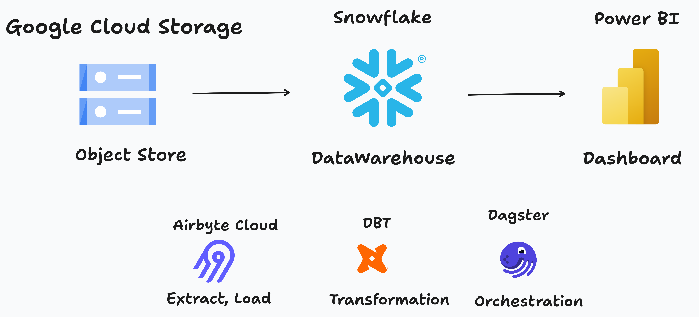
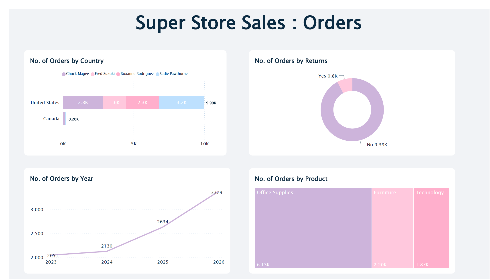

# Super Store Sales

A demo project showing how to integrate dbt models, Airbyte sources, and a Power BI semantic model using Dagster. This repository contains:

- dbt models (Snowflake): staging and marts for the Super Store Sales dataset
- Dagster assets: dbt multi-assets, Airbyte source placeholders, and Power BI semantic model components
- Component YAMLs under `dbt_super_store_sales/dbt_super_store_sales/dbt_super_store_sales/defs/`

## Showcase

- Mapped dbt models to Dagster `AssetKey`s with explicit translator for lineage and grouping.
- Materializable Airbyte source assets grouped under `aibyte` so sources appear in the asset graph.
- Power BI semantic model asset that depends on dbt model assets and can be refreshed via Dagster.

## Architecture

This diagram shows the end-to-end flow: Airbyte Cloud syncs source data into Snowflake; dbt transforms produce staging and mart models; Dagster (local or Dagster Plus) orchestrates dbt runs and exposes assets; Dagster triggers Power BI semantic model refreshes.

## Dagster Lineage View

## Power BI Report

Note:
This project was created in assistance with A.I